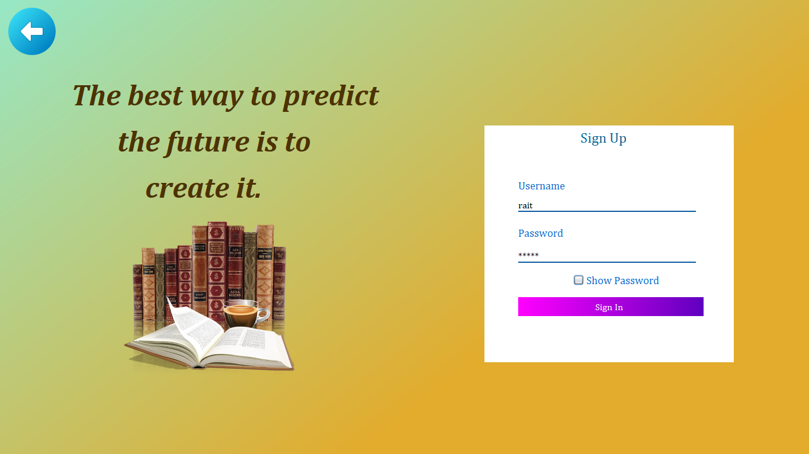
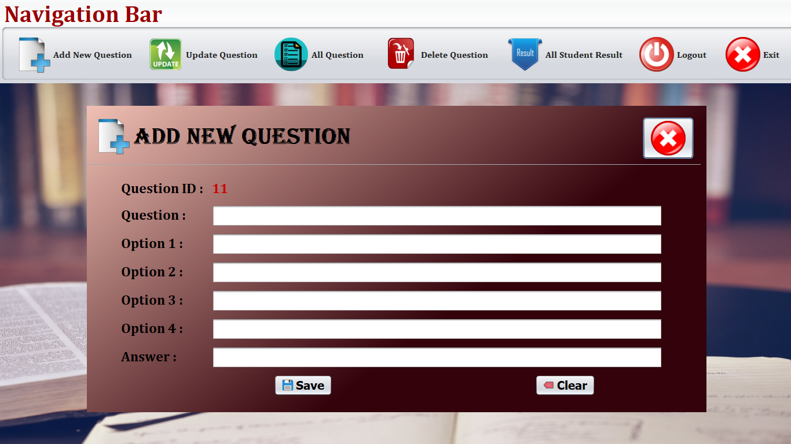
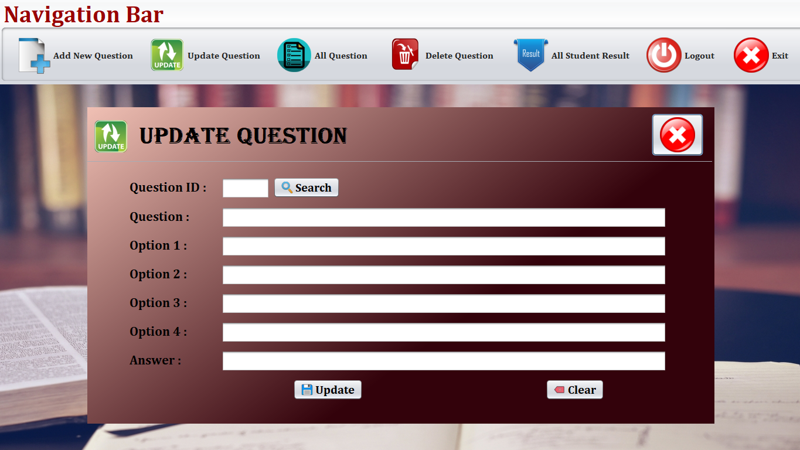
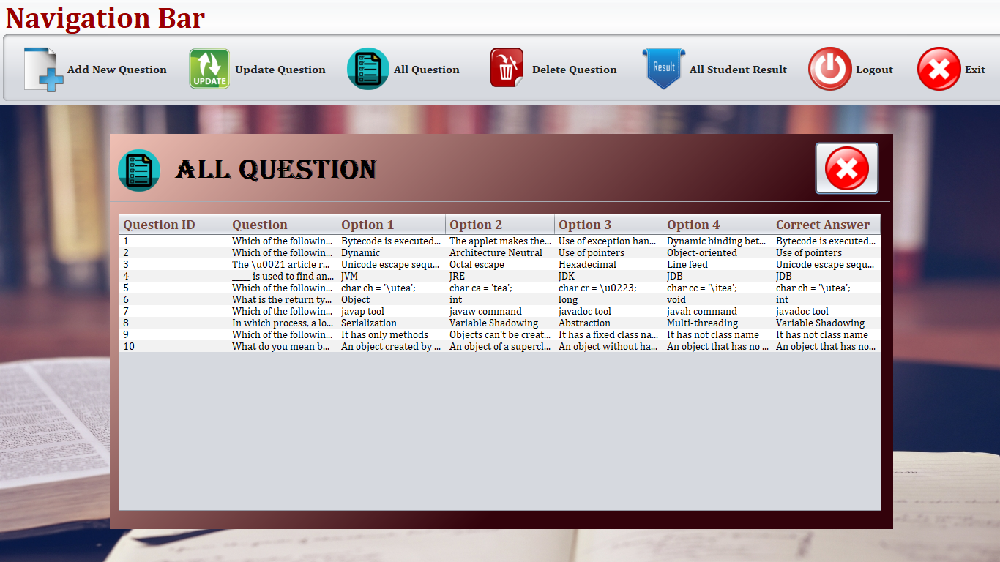
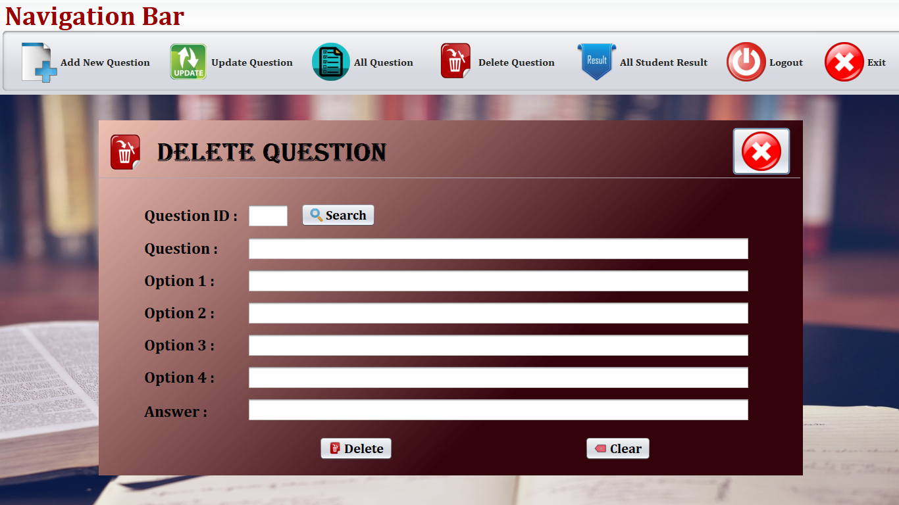
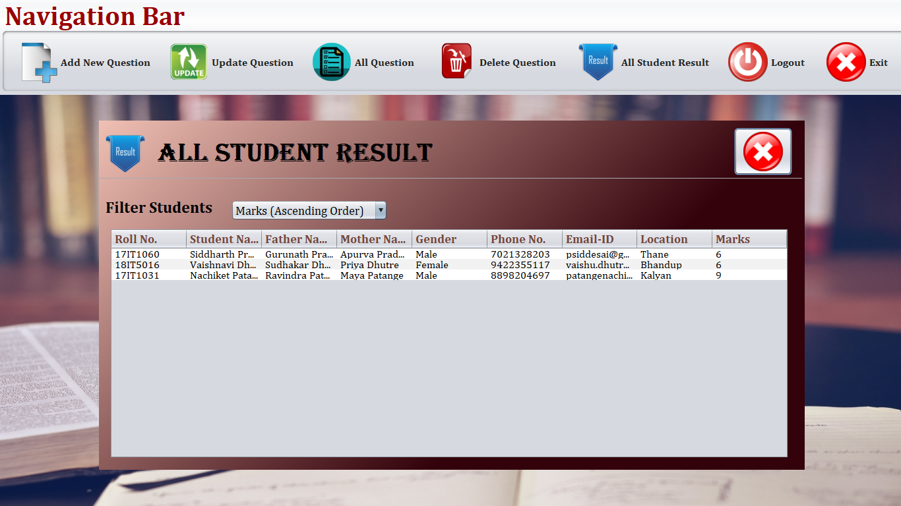
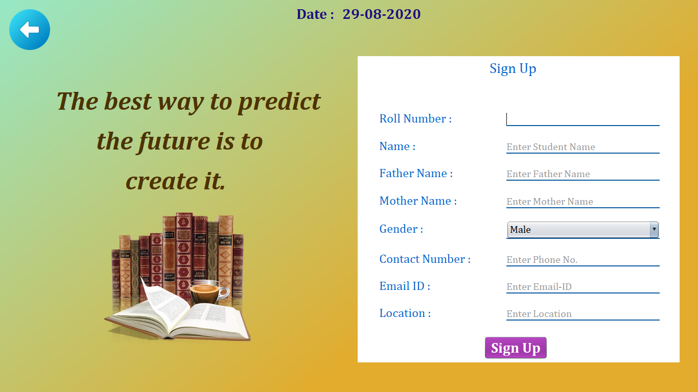
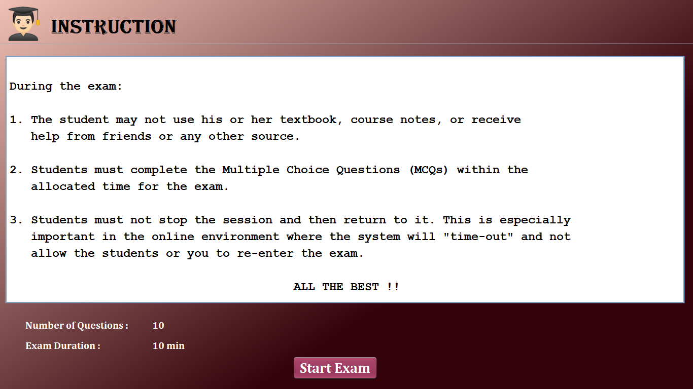
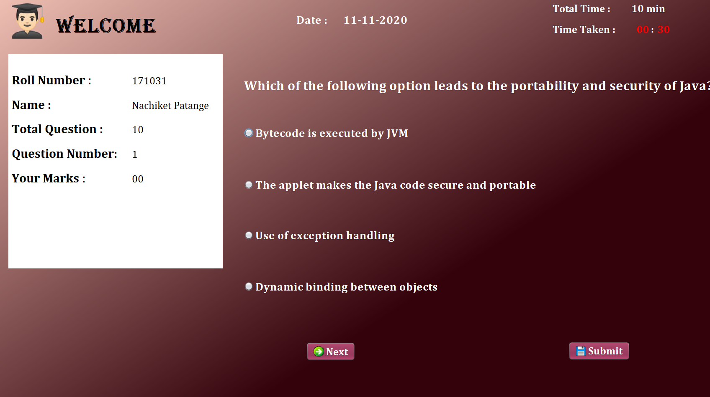
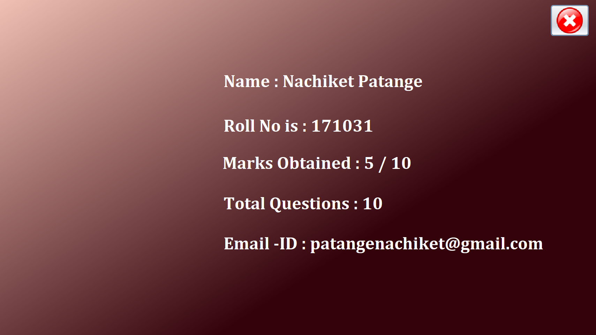

# Exam-Portal-Application
Quiz App is a fun new way to practice, improve, and test your Java skills, and test yourself in a truly.

## Libraries

<a href="https://dev.mysql.com/downloads/connector/j/" target="_blank">Connector/J (JDBC)</a>

<a href="https://github.com/k33ptoo/KGradientPanel.git" target="_blank">KGradientPanel</a>

## Requirements
Java version 8 or higher.

Maven.

IDE like NetBeans IDE.

MySQL database.

## Installation
1.Download the repository files (project) from the download section or clone this project by typing in the bash the following command:
<a href="https://github.com/Nachiket724/Exam-Portal-Application.git" target="_blank">https://github.com/Nachiket724/Exam-Portal-Application.git</a>

2.Open it in Apache NetBeans IDE and add all the libraries used (montioned above).

3.Import & execute the SQL queries from the Database folder to the MySQL database.
<a href="master/sql.txt" target="_blank">Libraries</a>

4.Run the application.

## Screenshots of Admin Section

## Screenshots of Student Section

